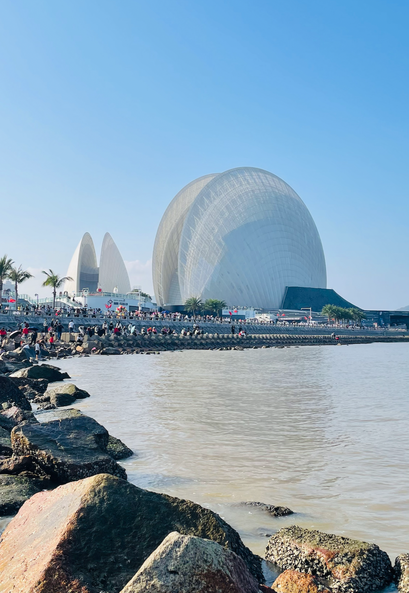
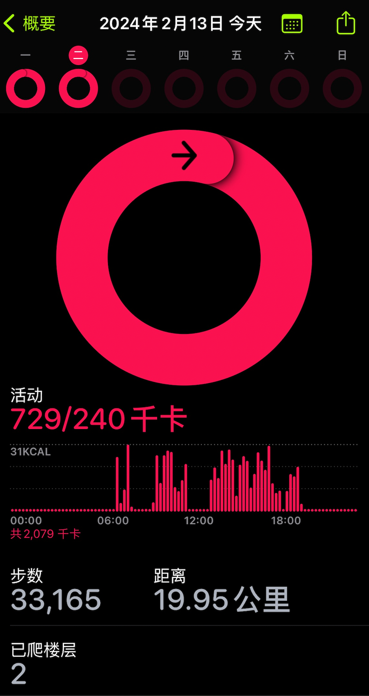

大年初四，起个大早去珠海玩了一天，没能去别的景点，就沿着“情侣路”徒步了一整天的时间。

坐轮渡过去的，船上的时间需要单程需要一小时左右，沿途能看到蜿蜒的 **粤港澳大桥**

到达沿途第一站：**热浪湾**，也即所谓的 *城市客厅* 所在地，这个沙滩质量很不错，沙地很细，海滨城市这点真的非常好， 一个沙滩整个休闲的感觉完全就出来了。还有各种小朋友在沙滩上的创作：

第二站： **爱情邮局**，这里是著名打卡点，其实就是一个卖明信片等的商业点，名字起的确实讨巧。这里更有名的是这个灯塔，如果人少点，拍出来应该更好看一些。

第三站： **珠海渔女**， 貌似有个传奇故事，但我没去了解。

发现周围的水上建筑和石头上布满了藤壶，密密麻麻的，密集恐惧症患者福音。

第四站：**城市阳台**，这是附近的沙滩，应该是个公园，名字原谅我居然忘记了，这一大片沙滩真的夏天乘凉圣地

第五站： **野狸岛**。 新开发出来的景点，正式运营应该也就三四年的时间。岛上没什么好玩的，不过可以租自行车环岛骑行，还是蛮放松的。

勤劳的蜜蜂，是不是在暗示我，初四都来了，上班还远吗？

第五站：**日月贝**。环岛一半后就可以看见这个庞然大物，以下各角度都是它的倩影。

返程途中，用我的 Iphone 12 拍出来的马赛克画质夜景中 **城市阳台**

这一圈下来一天走了近 20 KM ！

